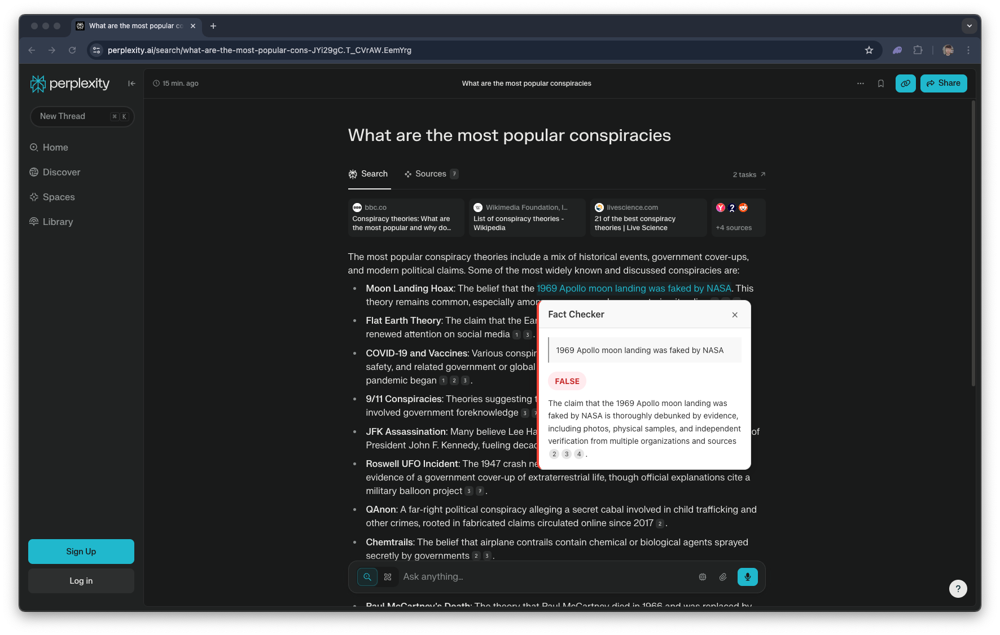

# Fact Checker

---

## 

[Watch the Demo](https://youtu.be/UJTCOHFIS7Y)

---

## About

> Fact Checker is a Chrome extension that empowers users to instantly verify information without leaving their browsing experience. In a world drowning in misinformation, this tool puts the facts just two clicks away.

## Features

- **Instant Fact Checking**: Highlight text, right-click, and select "Fact-Check with Perplexity" to verify claims
- **Clear Verdicts**: Results are clearly labeled as TRUE, FALSE, or UNCERTAIN
- **Citation Integration**: Citations appear as clickable numbers directly in the verification text
- **Non-disruptive UI**: Results appear in an elegant tooltip that doesn't interrupt your browsing
- **Visual Feedback**: Color-coded results make it easy to quickly determine a claim's validity

## Installation

1. Clone this repository or download the ZIP file
2. Open Chrome and navigate to `chrome://extensions/`
3. Enable "Developer mode" using the toggle in the top-right corner
4. Click "Load unpacked" and select the folder containing the extension files
5. The Fact Checker extension is now installed and ready to use
6. Before usage, select the chrome extension from the toolbar and save your API key.

## Usage

1. Highlight any text containing a claim you want to verify
2. Right-click and select "Fact-Check with Perplexity" from the context menu
3. A tooltip will appear with a loading indicator
4. Within seconds, the verification result will appear with:
   - The original claim you highlighted
   - A clear TRUE/FALSE/UNCERTAIN verdict
   - A detailed explanation with clickable citations
5. Click on any citation number to view the source

## How It Works

Fact Checker uses Perplexity's Sonar API to analyze claims against reliable information sources:

1. When you highlight text and select "Fact-Check", the extension sends the selected text to Perplexity's API
2. Perplexity analyzes the claim against real-time internet information
3. The API returns a verification result with citation sources
4. The extension parses the response and displays a user-friendly result in a tooltip
5. Citation links are embedded directly in the explanation text for easy access to sources

## Technical Implementation

The extension is built with:

- **TypeScript**: For type-safe, robust code
- **Chrome Extension APIs**: For context menu integration and content script injection
- **Perplexity Sonar API**: For reliable fact-checking capabilities

## Privacy

Fact Checker only sends the specific text you highlight for verification. No browsing history or personal data is collected or stored. All communication with the Perplexity API is done securely.

## Future Plans

- Support for additional browsers
- Customizable appearance options
- Ability to save verification history
- Batch verification of multiple claims
- Mobile extension support
